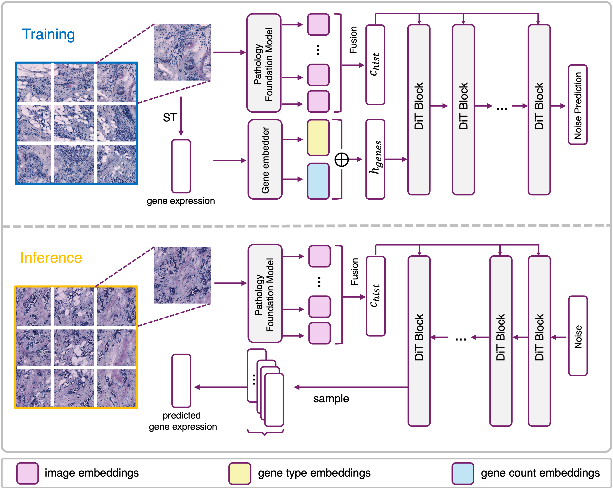

# Official Repo for paper "Diffusion Generative Modeling for Spatially Resolved Gene Expression Inference from Histology Images" (Stem)

**Abstract:**
Spatial Transcriptomics (ST) allows a high-resolution measurement of RNA sequence abundance by systematically connecting cell morphology depicted in Hematoxylin and Eosin (H&E) stained histology images to spatially resolved gene expressions. ST is a time-consuming, expensive yet powerful experimental technique that provides new opportunities to understand cancer mechanisms at a fine-grained molecular level, which is critical for uncovering new approaches for disease diagnosis and treatments. Here, we present **Stem** (**S**pa**T**ially resolved gene **E**xpression inference with diffusion **M**odel), a novel computational tool that leverages a conditional diffusion generative model to enable in silico gene expression inference from H&E stained images. Through better capturing the inherent stochasticity and heterogeneity in ST data, **Stem** achieves state-of-the-art performance on spatial gene expression prediction and generates biologically meaningful gene profiles for new H&E stained images at test time. We evaluate the proposed algorithm on datasets with various tissue sources and sequencing platforms, where it demonstrates clear improvement over existing approaches. **Stem** generates high-fidelity gene expression predictions that share similar gene variation levels as ground truth data, suggesting that our method preserves the underlying biological heterogeneity. Our proposed pipeline opens up the possibility of analyzing existing, easily accessible H\&E stained histology images from a genomics point of view without physically performing gene expression profiling and empowers potential biological discovery from H&E stained histology images.

## Latest Update
Our code is close to being cleaned up and will be released soon. Please stay tuned!
